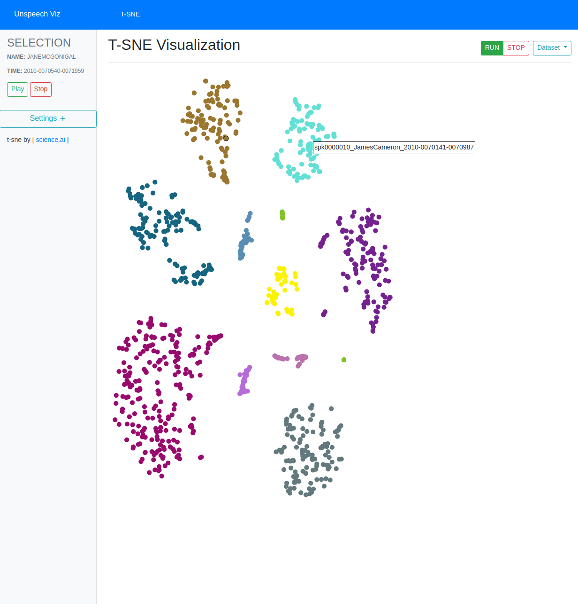

# Unspeech Visualization

This is a visualisation of unspeech (unspeech.net/preview) embeddings powered by T-SNE. A userguide can be found in this repository as userguide.pdf 

### Prerequisites
* Running:  [Docker](http://docker.io)
* Developing: [nodejs & npm](https://nodejs.org/en/)

## Getting Started (Running)

1. Clone this repository
2. Clone [unspeech](https://gitlab.com/milde/unspeech) into the directory of this repository
3. Build the Docker container e.g.: (```sudo docker build -t my-image2 .```)
4. Run the Docker container e.g.: (```sudo docker run -d my-image2```)
5. Visit ```http://localhost/static``` in browser

##### Directory structure
Your directory should be structured the following way:
```
/
--/unspeech/
--/unsvizu/
--/Dockerfile
--/nginx.conf
--/uwsgi.ini
--/Readme.MD
```
## Developing
The directory "unsvizu" contains the source code for the web application. It is written in JavaScript, HTML, CSS and can therefore be edited in any common IDE or Editor.

It is structured as follows:

* ```unsvizu/index.html``` - contains the HTML code for the application. Here layout changes can be made
* ```unviszu/css/style.css``` - The Stylesheet contains all settings concerning the style and layout of the application
* ```unviszu/js/scatterMe.js``` - Contains all the logical functions of the application. Any changes to the application logic should be made here.
* ```unviszu/js/service/data-service.js``` - Contains the functions for the GET and POST requests to get the Embedding Data provided by the unspeech feat server. 
* ```unviszu/js/tsneExample.js``` - The webworker that runs the tsne Calculation.

## Built With

* [d3js](http://www.dropwizard.io/1.0.2/docs/) - The web framework used
* [jQuery](https://maven.apache.org/) - Dependency Management
* [howler](https://rometools.github.io/rome/) - Used to generate RSS Feeds
* [tsnejs](https://github.com/scienceai/tsne-js) - JavaScript implementation of T-SNE algorithm

## Acknowledgments

* Hat tip to anyone whose code was used
* Benjamin's awesome unspeech project (http://unspeech.net/preview)
